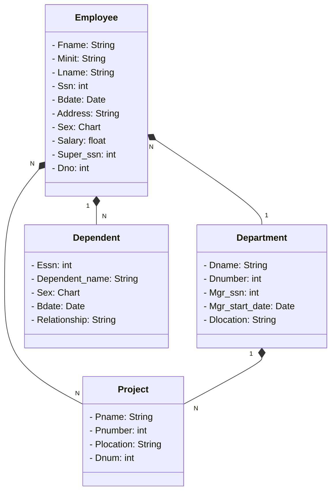

# Company

## Diagrama de Classes

```mermaid
classDiagram
    class Employee {
        - Fname: String
        - Minit: String
        - Lname: String
        - Ssn: int
        - Bdate: Date
        - Address: String
        - Sex: Chart
        - Salary: float
        - Super_ssn: int
        - Dno: int
    }

    class Department {
        - Dname: String
        - Dnumber: int
        - Mgr_ssn: int
        - Mgr_start_date: Date
        - Dlocation: String
    }

    class Dependent {
        - Essn: int
        - Dependent_name: String
        - Sex: Chart
        - Bdate: Date
        - Relationship: String
    }

    class Project {
        - Pname: String
        - Pnumber: int
        - Plocation: String
        - Dnum: int
    }

    Employee "N" *-- "1" Department
    Employee "N" *-- "N" Project
    Employee "1" *-- "N" Dependent
    Department "1" *-- "N" Project

```
